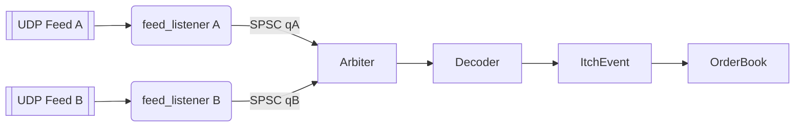

# 🧭 Parser → Order Book Entegrasyon Planı (nasdaq-itch-parser ➜ nasdaq-order-book)

Amaç: nasdaq-itch-parser'daki ağdan besleme (UDP multicast), A/B feed arbitration ve gap handling mimarisini temel alarak, mevcut nasdaq-order-book çekirdeğine (Optimized/Ultra OrderBook) düşük gecikmeli, tahsissiz (allocation-free) bir veri akışı bağlamak.

Durum Özeti
- Kaynak taban: nasdaq-itch-parser (multicast, iki feed, gap/dedupe, 8 çekirdek ITCH mesajı)
- Hedef taban: nasdaq-order-book (OptimizedOrderBook, UltraOrderBook, benchmarklar)
- Mevcut düzeltmeler: PRICE_LEVELS stack taşması giderildi; OptimizedOrderBook p50 ≈ 53ns addOrder

---

1) Hedef Mimari (Büyük Resim)
- Üreticiler (Producers): 2 x feed_listener (A ve B, UDP multicast, recvmmsg ile batch)
- Arbitration: Tek tüketici (Consumer) Arbiter thread
  - CommonHeader.trackingNumber ile sıralama, duplicate drop, bounded gap buffer
- Decoder: messageType → ItchEvent (allocation-free, string_view tabanlı)
- Dispatcher: ItchEvent → OrderBook.apply(event) (symbol_id ile hızlı yönlendirme)
- OrderBook: OptimizedOrderBook (debug) / UltraOrderBook (perf)

Veri Akışı


---

2) Modül ve Dosya Yapısı (Yeni/Revize)
- include/itch/messages.hpp
  - ITCH 5.0 packed struct'lar (nasdaq-itch-parser/itch_parser.hpp'dan taşınacak)
- include/itch/decoder.hpp, src/itch/decoder.cpp
  - buffer → ItchEvent dönüştürücü (allocation-free)
- include/core/event.hpp
  - ItchEvent türleri (Add/Exec/Cancel/Delete/Replace)
- include/core/symbol_table.hpp, src/core/symbol_table.cpp
  - symbol text → uint16_t symbol_id (allocation-free registry)
- include/core/packet.hpp
  - PacketView (pointer + len + tracking_number) – kopyasız
- include/net/feed_listener.hpp, src/net/feed_listener.cpp
  - UDP multicast alıcı (2 thread), recvmmsg, büyük RCVBUF, SPSC LockFreeQueue
- include/net/arbiter.hpp, src/net/arbiter.cpp
  - A/B arbitrasyonu, bounded gap buffer + aging/TTL
- main.cpp
  - CLI mod anahtarı: file veya network
  - network modunda yukarıdaki pipeline’ı kurar
- CMakeLists.txt
  - Yeni modüller ve Threads::Threads link

---

3) API Tasarımı (çekirdek arayüzler)

ItchEvent
```cpp path=null start=null
struct AddEvt   { uint64_t id; char side; uint32_t qty; uint32_t px; uint16_t sym_id; };
struct ExecEvt  { uint64_t id; uint32_t exec_qty; };
struct CancelEvt{ uint64_t id; uint32_t qty; };
struct DeleteEvt{ uint64_t id; };
struct ReplaceEvt{ uint64_t old_id; uint64_t new_id; uint32_t qty; uint32_t px; uint16_t sym_id; };
using ItchEvent = std::variant<AddEvt, ExecEvt, CancelEvt, DeleteEvt, ReplaceEvt>;
```

PacketView (kopyasız mesaj görünümü)
```cpp path=null start=null
struct PacketView {
  const char* data; 
  uint32_t    size; 
  uint16_t    tracking_number; // CommonHeader.trackingNumber
};
```

Arbiter sözleşmesi
```cpp path=null start=null
class Arbiter {
public:
  // Non-blocking pop; varsa bir PacketView döndürür
  bool poll(PacketView& out);
  // Gap ve duplicate yönetimini içeride yapar; poll çıktıları in-order ve unique olmalıdır
};
```

Dispatcher → OrderBook bağlama
```cpp path=null start=null
inline void apply(ItchEvent&& evt, OptimizedOrderBook& ob);
```

---

4) Performans Prensipleri
- std::string yerine std::string_view; symbol trim allocation’sız
- UDP alımda recvmmsg (batch) + büyük SO_RCVBUF + IP_MTU keşfi
- SPSC LockFreeQueue (mevcut lock_free_queue.hpp), her feed için ayrı
- gap_buffer bounded: kapasite (örn. 64K) + TTL (örn. 50ms) + drop metrics
- Decoder tahsissiz: memcpy yerine pointer cast + endian fix
- OrderBook çağrıları sıcak yol (inline), event-apply mikro-benchmarkları

---

5) CLI & Çalıştırma
- Varsayılan: dosyadan okuma (mevcut davranış)
- Network modu:
```bash
./build/bin/nasdaq_order_book \
  --mode=net \
  --mcast=239.0.0.1 \
  --port-a=5007 --port-b=5008 \
  --iface=0.0.0.0 \
  --rcvbuf=67108864 \
  --batch=32
```

---

6) Test Stratejisi
- Unit: decoder için fixture’lı binary mesaj örnekleri (hex_data.txt)
- Arbiter: sentetik trackingNumber dizileri ile gap/dupe senaryoları
- Integration: sender.py ile A/B yayını, %5 drop senaryosu (gap geri dolum logları)
- Micro-benchmark: 
  - buffer→ItchEvent decode (ns/op)
  - apply(Add/Exec/Cancel/Replace) (ns/op) – hedef p50 < 150ns
- Soak test: 10M mesajda memory leak yok, bounded gap_buffer doğrulanır

---

7) Adım Adım Uygulama (Sprint Planı)

Sprint 1 (1–2 gün)
- [ ] messages.hpp (parser’daki packed struct’lar taşınır)
- [ ] event.hpp ve symbol_table (allocation-free ID map)
- [ ] decoder.cpp (dosya buffer’ı için çalışır hale getirme)
- [ ] dispatcher: ItchEvent → OptimizedOrderBook.apply
- [ ] Mikro-benchmark: decode + apply

Sprint 2 (2–3 gün)
- [ ] feed_listener (UDP, recvmmsg, SPSC kuyruklar)
- [ ] arbiter (bounded gap buffer + metrics)
- [ ] CLI: --mode=net ve argümanlar
- [ ] sender.py düzeltmeleri ve yerel test

Sprint 3 (2 gün)
- [ ] Gözlemlenebilirlik: sayaçlar (gap_detected, gap_filled, dup_dropped)
- [ ] Performance tuning: RCVBUF, batch size, cache line alignment
- [ ] Stabilite: soak test, leak check, p50/p99 raporlama

---

8) Kabul Kriterleri (Acceptance)
- Doğruluk: A/B arbitre sonrası eventler trackingNumber sırasıyla ve duplicatesız uygulanır
- Kararlılık: gap_buffer bounded (kapasite ve TTL enforced); drop olduğunda metrik/log
- Performans (micro): 
  - Decode(Add) p50 < 80ns, apply(Add) p50 < 120ns (toplam < 200ns hedef)
- Entegrasyon: sender.py senaryosunda gap’ler otomatik kapanır, dupe’lar reddedilir

---

9) Riskler & Önlemler
- Unbounded buffer → bounded gap buffer + backpressure/loglama
- Allocation baskısı → object pool ve string_view, recvmmsg ile batch
- CPU çeşitliliği → AVX2 path + scalar fallback; -march=native kullanıcıda kapatılabilir
- Network izinleri → mcast join ve RCVBUF için uygun sysctl/güvenlik ayarları

---

10) Hemen Sonraki Adımlar (Bu repo’da)
- [ ] include/itch/messages.hpp dosyasını oluştur (kaynak: nasdaq-itch-parser/itch_parser.hpp)
- [ ] include/core/{event.hpp,symbol_table.hpp} iskeleti
- [ ] src/itch/decoder.cpp: dosya modunda çalışır hali
- [ ] main.cpp: --mode bayrağı altyapısı (şimdilik sadece file/decoder yolu)
- [ ] CMakeLists.txt: yeni hedefleri ekle (boş kaynaklarla derlenebilir)

Notlar
- sender.py’deki f-string satır içi formatlamalar bozulmuş; tek satıra alıp doğrulayacağız
- PRICE_LEVELS şimdilik 40k–60k aralığında (stack güvenliği). Ultra için heap/pool’a taşıma ayrı PR.

